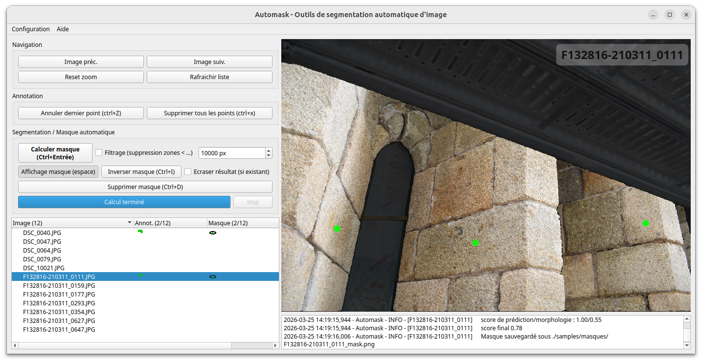

# Automask

Automask est un outil semi-automatique de création de masque par segmentation d'image. Il est adapté à la création de masque pour des projets de photogrammétrie. L'outil est basé sur le modèle Segment Anything (SAM) de Meta AI.

Automask est développé par AGEO (Alexandre Guyot) avec le soutien du Service Régional de l'Archéologie / DRAC Bretagne et le support de Philippe Boulinguiez (INRAP Grand Ouest).



## Installation

L'installation d'Automask utilise un environnement virtuel python (venv), ce qui permet d'exécuter Python et toutes les dépendances de manière isolée et multi-plateformes (Windows, Linux).  
Sous Windows, l'installation ne nécessite pas de droits administrateurs, et le logiciel peut être supprimé simplement en supprimant le dossier d'installation.

3Go d'espace disque sont nécessaires pour installer Automask.  

La procédure d'installation est présentée ci-dessous : 


### Installation Windows

#### Vérification / installation des pré-requis sous Windows

Automask nécessite les prérequis suivants :

 - Microsoft Visual C++ v14 Redistributable
 - Python 3.11

Pour vérifier si vous disposez des prérequis : 
> sous Windows11 > Menu démarrer > Paramètres > Applications > Applications installées

Puis, si nécessaire, pour installer ces pré-requis (Windows 11):
   - Microsoft Visual C++ Redistributable : https://aka.ms/vc14/vc_redist.x64.exe
   - Python 3.11 (avec Pyton Manager): https://www.python.org/ftp/python/3.11.9/python-3.11.9-amd64.exe

⚠️ Attention un redémarrage est nécessaire après l'installation des pré-requis.
   
#### Installation Automask sous Windows

1. Vérifier les pré-requis ci-dessus
2. Télécharger l'archive zip du dépôt: https://github.com/ageo-fr/automask/archive/refs/heads/main.zip
3. Décompresser l'archive sur votre PC (le dossier de décompression sera le dossier d'installation d'Automask)  
   [!! Bonne pratique !!] Eviter les chemins avec espaces ou caractères spéciaux (souvent sources d'erreurs logiciels)
4. Depuis le "Menu Démarrer", lancer l'invite de commande ou ```cmd```
5. Se déplacer vers le dossier ```automask``` décompressé précedemment. Ex. ```cd "c:\automask"```
6. Executer le script d'installation Automask avec la commande suivante :  ```py -3.11 install\install.py```
      
### Installation Linux

#### Vérification / installation des pré-requis sous Linux

Sous Linux, l'installation nécessite python 3.11 :

```
sudo apt update
sudo apt install python3.11 python3.11-venv python3.11-dev
```
#### Installation Automask sous Linux

1. Vérifier les pré-requis ci-dessus
2. Télécharger l'archive zip du dépôt: https://github.com/alexguyot/automask/archive/refs/heads/main.zip
3. Décompresser l'archive (le dossier de décompression sera le dossier d'installation d'Automask)
4. Depuis le terminal de commande, se déplacer vers le dossier ```automask``` décompressé précedemment. Ex. ```cd "automask"```
5. Executer le script d'installation Automask avec la commande suivante :  ```python3.11 install\install.py```


## Lancement / exécution

### Lancement sous Windows

1. Depuis le "Menu Démarrer", lancer l'invite de commande ou ```cmd```
2. Se déplacer vers le dossier dans lequel Automask a été installé. Ex. ```cd "c:\automask"```
3. Exécuter le script de lancement Automask avec la commande suivante :  ```automask_run.bat```

### Lancement sous Linux

1. Depuis le terminal de commande, se déplacer vers le dossier dans lequel Automask a été installé. Ex. ```cd "automask"```
2. Exécuter le script de lancement Automask avec la commande suivante :  ```bash automask_run.sh```
